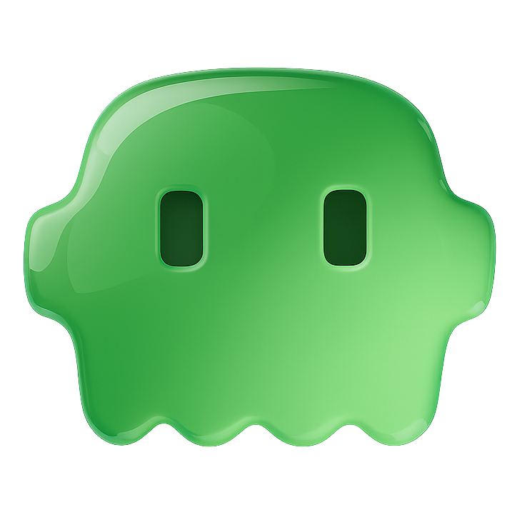

<p align="center">
  
</p>

<h1 align="center">autoclaw</h1>

<p align="center">
  <strong>The agentic interface layer for macOS. Collapses the cognitive load between you and AI.</strong>
</p>

<p align="center">
  
  
  
  
</p>

<p align="center">
  <!-- TODO: Replace with GIF -->
  <em>[ demo GIF: Fn → prediction cards → speak → text lands → Claude builds it ]</em>
</p>

---

## The problem

When agentic intelligence lives only within apps, the cognitive load falls on *you* — knowing what to do, how to ask, when to ask, which app to use, prompt engineering, skill availability. The AI is capable. The bottleneck is the interface.

## The solution

Agentic intelligence that lives at the **interface layer** — between you and every AI tool — to absorb that cognitive load entirely.

**autoclaw** is this layer for macOS.

Built by [The Last Prompt](https://thelastprompt.ai).

---

## Phase 1 — Voice-first Claude Code interface (now)

A parallel low-intelligence pipeline between you and Claude Code that makes interaction seamless:

```
You think it → You say it → Claude builds it
```

**Fn.** Two cards appear — autoclaw already read your session and knows what you'll say. Tap one. Or speak. Clean text lands at your cursor. Claude picks it up and runs.

No typing. No prompt engineering. No context switching.

### How it works

```
Your Claude Code session (JSONL)
       │ watches live
       ▼
  Fn → Toast appears
       ├── 2 PM recommendation cards (tap "Use" or "Add" to board)
       ├── Mic goes live
       │     │
       │     ▼ You speak naturally
       │     │
       │     ├── WhisperKit (local, Neural Engine)
       │     │     ├── Raw text → cursor INSTANTLY
       │     │     └── Agentic Enhance (background) → turns casual speech
       │     │         into effective prompts. Accept or keep raw.
       │     │
       │     └── + button saves transcript to kanban board
       │
       └── Theater PIP (optional)
             TV characters narrate your session ELI5-style
```

### PM agent

A persistent Haiku session runs as your product manager — not a code reviewer, a PM. It reads your CLAUDE.md, your live session JSONL, and your coding tempo, then asks:

- What did you just build? Does it connect to the rest of the product?
- What error paths are you ignoring?
- Are you going deep on one feature while other areas rot?
- What would a PM flag in a launch review?

Recommendations show as tappable cards in the toast — plain English, one sentence, the way you'd say it to a colleague:

> *"make the board refresh live when things change"*
> *"add a timeout so the app doesn't hang when haiku is slow"*

Predictions refresh automatically via JSONL file watcher. The PM also maintains a kanban board (`.autoclaw/board.md`) — moving completed work to Done, surfacing new todos, tagging priorities.

### Agentic enhance

Enhancement isn't grammar cleanup. It's an invisible prompt engineering layer:

- **In Claude Code / terminals:** Translates casual speech into effective prompts. "fix that thing with the toast" becomes a structured instruction with the right file and function names — but preserves your references when Claude already has context ("update these numbers" stays as-is because Claude knows what "these" means).
- **In Gmail / Slack / Notion:** Clean tone-aware rewrite. No project context leaking into your emails.
- **Context-aware routing:** Autoclaw resolves web apps — "Google Chrome" becomes "Gmail", "Notion", "Claude" — so the right enhance path fires automatically.

### Works everywhere

Voice-to-text works in any app. Context-aware tone: casual for Slack, professional for email, precise for terminal, polished for docs. Project context only injects when relevant.

---

## Phase 2 — Workflow learning (built, shipping next)

Autoclaw watches you work, extracts patterns, and creates reusable automations — without you ever opening an automation builder.

| Mode | What it does | Status |
|------|-------------|--------|
| **Learn** | Do something once, Claude extracts a reusable workflow template | Built |
| **Task** | Speak or paste a command, Claude handles it with full MCP access | Built |

---

## Phase 3 — Ambient detection (built, shipping later)

Autoclaw recognizes tasks ambiently and offers to handle them. You approve or ignore. The OS becomes the trigger, not you.

| Mode | What it does | Status |
|------|-------------|--------|
| **Analyze** | Watches your screen, detects actionable moments, offers to help before you ask | Built |

---

## Theater Mode

<p align="center">
  <em>[ screenshot: Theater PIP — Gilfoyle & Dinesh roasting your code decisions ]</em>
</p>

Floating PIP with an animated stage. 24 themed scene locations, chibi character sprites with idle/talking/gesturing animations, camera system with 5 shot types, dialogue bubbles. TV characters watch your Claude Code session and explain what's happening — completely in character.

> **Gilfoyle:** A DispatchSource. It's basically a file stalker.
> **Dinesh:** So it watches files? Like my ex watches my Instagram?

8 character duos across 8 shows. Dialog adapts to your coding pace. Cold opens play instantly. Fillers bridge quiet moments. Voice playback via owned TTS sidecar. Non-repeatable — every performance plays exactly once.

<details>
<summary><strong>Character pairs</strong></summary>

| Theme | Characters | You are |
|-------|-----------|---------|
| Silicon Valley | Gilfoyle & Dinesh | Richard |
| Schitt's Creek | David & Moira | Johnny |
| The Office | Dwight & Jim | Michael |
| Friends | Chandler & Joey | Ross |
| Rick and Morty | Rick & Morty | Jerry |
| Sherlock | Sherlock & Watson | Lestrade |
| Breaking Bad | Jesse & Walter | Hank |
| Iron Man | Tony & JARVIS | Pepper |

</details>

<details>
<summary><strong>Voice playback</strong></summary>

Text-only dialog works out of the box. For character voices:

```bash
pip install autoclaw-theater
# autoclaw auto-launches the voice server when Theater Mode is active
```

First install downloads ~500MB of model weights (once). Voices are cached to `.autoclaw/voice-cache/`. [Autoclaw Theater repo](https://github.com/sameeeeeeep/autoclaw-theater)

</details>

---

## Board

A floating kanban widget that tracks your project. The PM agent maintains it — moving completed work to Done, surfacing new todos based on what's happening in your session.

- **Add** a prediction to the board for later
- **Tap** any board item to inject it at your cursor + clipboard
- **+** on any transcript to save it as a todo

Toggle from the toast header. Lives at bottom-left, Theater at bottom-right.

---

## Quick start

```bash
git clone https://github.com/sameeeeeeep/autoclaw.git
cd autoclaw
make run
```

**Requirements:** macOS 14+, Claude Code CLI, Xcode 15+. Grant Accessibility + Microphone when prompted.

**Optional:**
```bash
ollama pull qwen2.5:3b          # local bouncer for Analyze mode
pip install autoclaw-theater     # Theater mode voice playback
```

---

## Controls

| Key | Action |
|-----|--------|
| **Fn** | Open toast / start recording / stop recording |
| **Right Shift** | Cycle modes |
| **Left Option x2** | Full dismiss |
| **Option + Z** | Dismiss toast, keep session |
| **Option + X** | Cycle sub-mode |

---

## Build

| | |
|---|---|
| `make` / `make spm` | Release build (SPM + WhisperKit) |
| `make debug` | Fast iteration |
| `make legacy` | No WhisperKit, Apple Speech fallback |
| `make dmg` | Distributable DMG |
| `make run` | Build + launch |

---

## Under the hood

58 Swift files across 2 SPM targets. Theater is a separate `AutoclawTheater` library module — fully opt-out. WhisperKit on Neural Engine. Persistent Haiku sessions via Claude CLI. JSONL file watcher with 4s debounce. Session tempo tracking. Voice caching. PM agent with sandboxed file access. Liquid glass UI on macOS 26 Tahoe.

Full architecture, sensor pipeline, file inventory, and every design decision in [CLAUDE.md](CLAUDE.md).

---

<p align="center">
  <a href="https://thelastprompt.ai">The Last Prompt</a> · <a href="LICENSE">MIT License</a>
</p>

<p align="center">
  <em>You think it. You say it. Claude builds it.</em>
</p>
